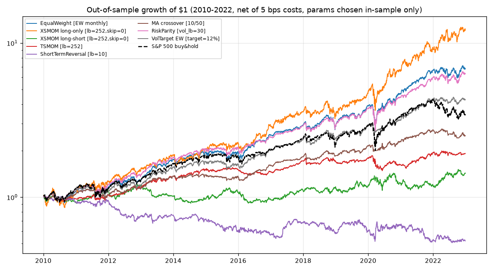
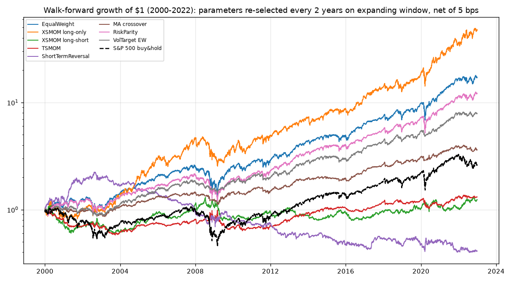
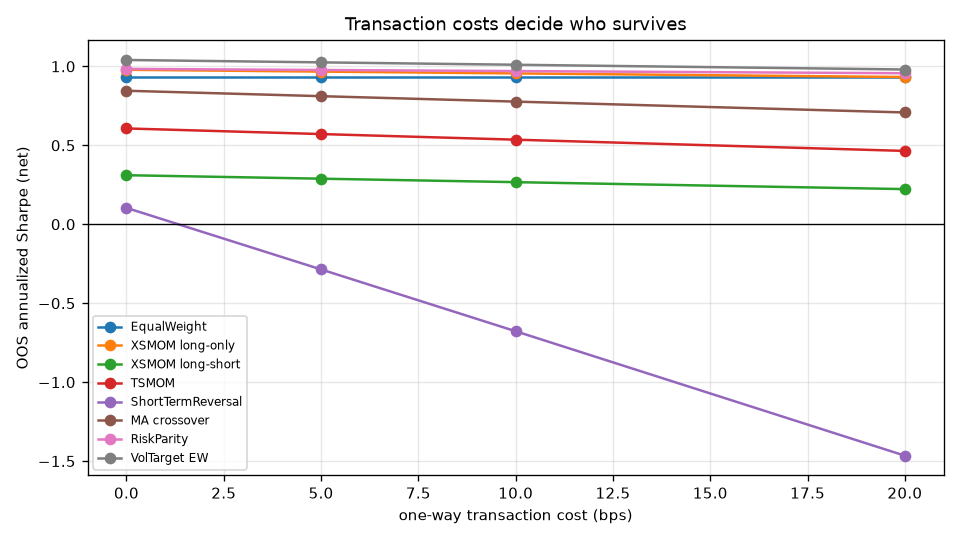
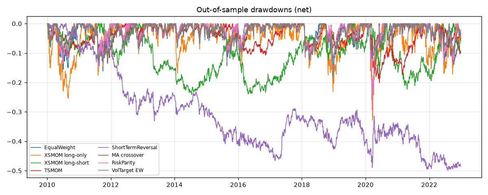

# Trading strategy study: what survives a correct backtest

*Generated by `run_study.py`. Universe: 20 US large-cap stocks (bundled real daily prices from the `skfolio` package), 1990-01-02 to 2022-12-28. Benchmark: S&P 500 index.*

## Protocol (the point of this study)

- **No lookahead**: every signal at date *t* uses data through *t* only; the engine applies weights with a **one-day execution lag**.
- **Costs**: 5 bps one-way on all turnover (sensitivity at 0/5/10/20 bps below).
- **In-sample / out-of-sample**: parameters chosen on 1990-2009 by net Sharpe; 2010-2022 evaluated exactly once.
- **Walk-forward**: parameters re-selected every ~2 years on an expanding window from 2000 — what a live investor could actually have done.
- **Multiple testing**: 24 configurations were tried in total; the Deflated Sharpe Ratio (DSR) charges each result for all of them. DSR > 0.95 = unlikely to be selection luck.
- **Bootstrap**: 95% CIs for Sharpe from a 21-day moving-block bootstrap.

## Out-of-sample results (2010-2022, net of 5 bps)

| Family                   | Config (chosen in-sample)   |   IS Sharpe |   Sharpe |   Sharpe 95% CI lo |   Sharpe 95% CI hi |   CAGR |   AnnVol |   MaxDD |   AnnTurnover |     DSR |
|:-------------------------|:----------------------------|------------:|---------:|-------------------:|-------------------:|-------:|---------:|--------:|--------------:|--------:|
| EqualWeight              | EW monthly                  |       1.031 |    0.931 |              0.408 |              1.53  |  0.159 |    0.175 |  -0.317 |         0     |   0.913 |
| XSMOM long-only          | lb=252,skip=0               |       1.191 |    0.968 |              0.496 |              1.514 |  0.212 |    0.225 |  -0.328 |         5.086 |   0.931 |
| XSMOM long-short         | lb=252,skip=0               |       0.185 |    0.289 |             -0.246 |              0.824 |  0.028 |    0.119 |  -0.241 |         5.225 |   0.175 |
| TSMOM                    | lb=252                      |       0.501 |    0.572 |              0.058 |              1.145 |  0.051 |    0.096 |  -0.201 |         6.789 |   0.532 |
| ShortTermReversal        | lb=10                       |       0.303 |   -0.285 |             -0.798 |              0.227 | -0.049 |    0.141 |  -0.498 |       110.313 |   0.001 |
| MA crossover             | 10/50                       |       1.09  |    0.812 |              0.305 |              1.368 |  0.073 |    0.092 |  -0.135 |         6.327 |   0.822 |
| RiskParity               | vol_lb=30                   |       0.978 |    0.978 |              0.464 |              1.594 |  0.152 |    0.158 |  -0.301 |         2.137 |   0.936 |
| VolTarget EW             | target=12%                  |       1.129 |    1.026 |              0.485 |              1.576 |  0.118 |    0.116 |  -0.139 |         3.452 |   0.954 |
| S&P 500 index (buy&hold) | -                           |       0.397 |    0.618 |              0.145 |              1.209 |  0.099 |    0.178 |  -0.339 |       nan     | nan     |

## Walk-forward results (2000-2022, net of 5 bps)

|                   |   Sharpe |   CAGR |   AnnVol |   MaxDD |
|:------------------|---------:|-------:|---------:|--------:|
| EqualWeight       |    0.728 |  0.131 |    0.196 |  -0.484 |
| XSMOM long-only   |    0.831 |  0.183 |    0.235 |  -0.47  |
| XSMOM long-short  |    0.136 |  0.009 |    0.134 |  -0.455 |
| TSMOM             |    0.16  |  0.012 |    0.119 |  -0.421 |
| ShortTermReversal |   -0.17  | -0.038 |    0.157 |  -0.822 |
| MA crossover      |    0.621 |  0.057 |    0.097 |  -0.234 |
| RiskParity        |    0.709 |  0.115 |    0.175 |  -0.45  |
| VolTarget EW      |    0.822 |  0.094 |    0.118 |  -0.246 |

## Transaction-cost sensitivity (OOS Sharpe)

|                   |   0 bps |   5 bps |   10 bps |   20 bps |
|:------------------|--------:|--------:|---------:|---------:|
| EqualWeight       |   0.931 |   0.931 |    0.931 |    0.931 |
| XSMOM long-only   |   0.979 |   0.968 |    0.956 |    0.933 |
| XSMOM long-short  |   0.311 |   0.289 |    0.267 |    0.223 |
| TSMOM             |   0.608 |   0.572 |    0.536 |    0.465 |
| ShortTermReversal |   0.104 |  -0.285 |   -0.677 |   -1.465 |
| MA crossover      |   0.846 |   0.812 |    0.778 |    0.709 |
| RiskParity        |   0.985 |   0.978 |    0.971 |    0.957 |
| VolTarget EW      |   1.041 |   1.026 |    1.011 |    0.981 |

## Caveats (read before believing anything above)

- **Survivorship bias**: the 20 stocks are *current* S&P 500 members that existed through 1990-2022. Long-only absolute returns are inflated; relative comparisons between strategies are more trustworthy than levels.
- **Small universe**: 20 names is thin for cross-sectional strategies; published momentum/reversal studies use thousands of stocks.
- **Execution model**: close-to-close fills, linear costs, no market impact, no borrow fees on shorts, no taxes.
- **No order-book data**: every market-data host is blocked by this environment's network policy, so the order-book signal module (`orderbook_signals.py`: queue imbalance, microprice, Cont-Kukanov-Stoikov OFI) ships verified code but no empirical results. Backtesting microstructure alpha on synthetic books would be self-deception.
- **There are no guaranteed 'winning' strategies.** The honest output of a correct backtest is a small set of risk premia (momentum, trend, vol-targeting) with modest Sharpe and fat left tails — not a money machine.
